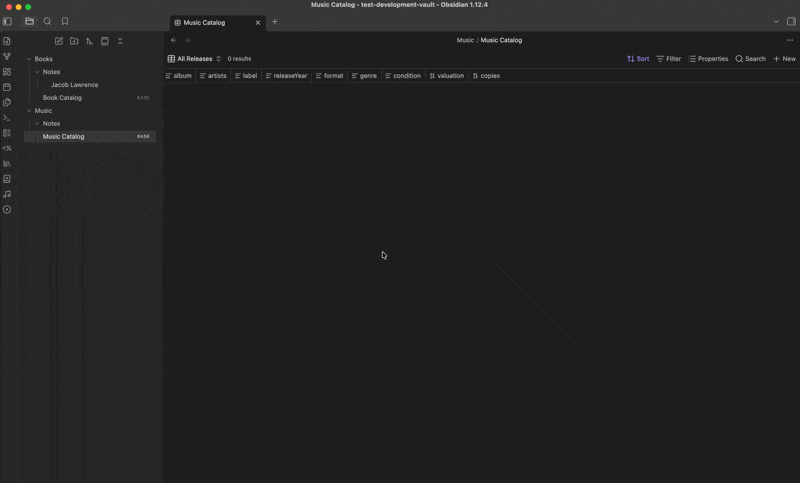

# Music Catalog

An Obsidian plugin for cataloging your vinyl record and CD collection. Scan UPC barcodes or search by title, artist, label, composer, and conductor to automatically pull metadata from Discogs and MusicBrainz, then save a structured note for each release directly in your vault.



## Features

- **Barcode scanning** — scan UPC barcodes with a USB or Bluetooth barcode scanner; the code is captured instantly as if typed into the input field
- **Manual search** — search by title and any combination of artist, label, composer, and conductor when no barcode is available
- **Classical / opera / soundtrack support** — composer and conductor fields run as separate queries and results are merged, surfacing specific pressings of heavily-recorded works
- **Format filtering** — filter search results to CD Only or LP Only before searching
- **Automatic metadata** — album title, artists, label, catalog number, release year, genre, format, and cover art are fetched automatically
- **Condition tracking** — record physical condition using standard vinyl collector grades: Mint (M), Near Mint (NM), Very Good Plus (VG+), Very Good (VG), Good Plus (G+), Good (G), Fair (F), Poor (P)
- **Copies tracking** — track how many copies of a release you own; if you scan a duplicate, the plugin detects it and offers to update the copy count rather than creating a duplicate note
- **Valuation** — record the estimated value of each release
- **Acquisition date** — defaults to today, editable before saving
- **Custom fields** — add your own fields to the capture modal (text, number, date, or boolean toggle); all custom values are saved to the note's frontmatter
- **Configurable save behavior** — choose whether "Save & Add Another" or "Save Release" is the primary button in settings, useful for single-add vs. batch workflows
- **Catalog view** — a dedicated ribbon icon opens the Music Catalog base table view directly
- **Obsidian Bases integration** — automatically creates and manages a `.base` file with pre-configured table views: All Releases, By Year, By Artist, and Needs Condition
- **Vault reorganization** — a built-in tool scans your entire vault for release notes (by tag) and moves them to your configured folder, regardless of where they currently live
- **iOS compatible** — notes and the Base table view sync to iOS via Obsidian Sync and are fully readable on mobile (plugin features require desktop)

## Network Use

This plugin makes network requests to third-party services to retrieve release metadata. No personal data, vault content, or user information is ever sent. The only data transmitted is the UPC barcode or search terms you enter.

| Service | Purpose | When used | Authentication |
|---------|---------|-----------|----------------|
| [Discogs](https://www.discogs.com) | UPC lookup and title/artist/label search (primary) | When a personal access token is configured | Your personal access token |
| [MusicBrainz](https://musicbrainz.org) | UPC lookup and title/artist search (fallback) | Always available, used when Discogs is not configured or returns no results | None required |

No telemetry, analytics, or usage data of any kind is collected or transmitted by this plugin.

## Requirements

- Obsidian v1.8.0 or later (required for Obsidian Bases support)
- Desktop Obsidian (community plugins are not supported on iOS/Android)

## Installation

### From the Obsidian Community Plugin Store (recommended)

1. Open Obsidian **Settings → Community plugins**
2. Turn off Restricted mode if prompted
3. Click **Browse** and search for **Music Catalog**
4. Click **Install**, then **Enable**

### Manual installation

1. Download `main.js` and `manifest.json` from the [latest release](https://github.com/jimparrillo/obsidian-music-catalog/releases)
2. Create a folder called `music-catalog` inside your vault's `.obsidian/plugins/` directory
3. Copy both files into that folder
4. Reload Obsidian and enable the plugin in **Settings → Community plugins**

## Setup

### 1. Configure your folders

Go to **Settings → Music Catalog → File Organization** and set:

- **Catalog folder** — where `Music Catalog.base` will be created (e.g. `Music` or `03 Resources/Music`)
- **Notes subfolder** — subfolder inside the catalog folder for individual release notes (e.g. `Notes`); leave blank to store notes directly in the catalog folder

### 2. Create the Base file

Click **Create Base File** in settings. This creates `Music Catalog.base` at your configured path with all table views pre-configured. You need [Obsidian Bases](https://obsidian.md/bases) enabled (available in Obsidian v1.8+).

### 3. Optional: Discogs personal access token

MusicBrainz is available with no setup required. For richer metadata — pressing details, catalog numbers, and cover art — add a Discogs personal access token:

1. Log into [discogs.com](https://www.discogs.com)
2. Click your username → **Settings** → **Developers**
3. Click **Generate new token**
4. Paste the token into **Settings → Music Catalog → API → Discogs personal access token**

> **Important:** Use a Personal Access Token, not a Consumer Key or Consumer Secret. Those are for OAuth and will not work here.

## Usage

### Adding a release by barcode

1. Click the **disc icon** in the left ribbon, or use the command palette → **Add music**
2. The modal opens with focus in the barcode field — scan or type a UPC
3. Press Enter or click **Look Up Release**
4. Review the metadata preview, set condition, copies, acquisition date, and value
5. Click **Save Release** or **Save & Add Another** to save and immediately scan the next item

### Adding a release by title search

1. Open the Add Music modal and click the **Search by Title** tab
2. Enter a title (required) and optionally any combination of Artist, Label, Format filter, Composer, and Conductor
3. Click **Search Releases** — results appear inline below the form
4. Click any result card to proceed to the confirm step

### Searching for classical, opera, and soundtracks

For works with many recordings — Beethoven symphonies, Verdi operas, film soundtracks — use the fields under the **Classical / Opera / Soundtrack** divider:

- **Composer** — e.g. `Verdi`
- **Conductor** — e.g. `Muti`
- **Artist** — e.g. `Caballé`
- **Label** — e.g. `Angel`

Each non-empty artist term runs as a separate query. Results are merged and deduplicated. Use the **LP Only** or **CD Only** format filter to reduce noise when you know the format.

### Viewing the catalog

Click the **music note icon** in the left ribbon to open the Music Catalog table view directly.

### Handling duplicates

If you scan a release that already exists in your catalog, the plugin shows the existing entry with the current copy count and offers to update it rather than creating a duplicate note.

### Custom fields

Go to **Settings → Music Catalog → Custom Fields** to add your own fields. Each field has a name and a type (text, number, date, or boolean toggle). Custom fields appear in the confirm modal below the standard fields and are saved to the note's frontmatter using the field name as the YAML key (spaces become hyphens).

Examples: `pressing-country` (text), `purchase-price` (number), `sealed` (boolean), `listen-date` (date).

## Note format

Each release is saved as a Markdown file with YAML frontmatter:

```yaml
---
album: "Kind of Blue"
artists: ["Miles Davis"]
label: "Columbia"
catalogNumber: "CL 1355"
releaseYear: 1959
genre: ["Jazz", "Modal"]
format: "12\" Vinyl"
upc: ""
cover: "https://..."
condition: "Near Mint (NM)"
acquired: "2026-03-16"
valuation: 45
copies: 1
tags: ["record"]
---
```

Followed by a cover image (when available from Discogs) and a `## Notes` section for personal annotations. Any custom fields you have configured appear between `copies` and `tags`.

## Condition grades

| Grade | Description |
|-------|-------------|
| Mint (M) | Perfect, unplayed |
| Near Mint (NM) | Nearly perfect, minimal signs of handling |
| Very Good Plus (VG+) | Shows some signs of play but still excellent |
| Very Good (VG) | Noticeable surface marks, plays through cleanly |
| Good Plus (G+) | Heavy marks, plays with noise |
| Good (G) | Very heavy marks, plays throughout |
| Fair (F) | Severely damaged, plays with difficulty |
| Poor (P) | Barely playable |

## Reorganizing existing notes

If you change your folder settings after adding releases, use **Settings → Reorganize Files → Scan Vault & Reorganize**. The tool scans your entire vault for notes tagged `#record`, shows you what it found and where, then moves everything to the correct location after you confirm.

## Settings reference

| Setting | Description | Default |
|---------|-------------|---------|
| Catalog folder | Where `Music Catalog.base` is created | `Music` |
| Notes subfolder | Subfolder inside catalog folder for release notes | `Notes` |
| Default to Save & Add Another | Makes "Save & Add Another" the primary button | On |
| Custom Fields | Add user-defined fields to the capture modal | None |
| Discogs personal access token | Optional primary metadata source | Empty |

## Support

For bug reports and feature requests, please use the [GitHub Issues page](https://github.com/jimparrillo/obsidian-music-catalog/issues).
